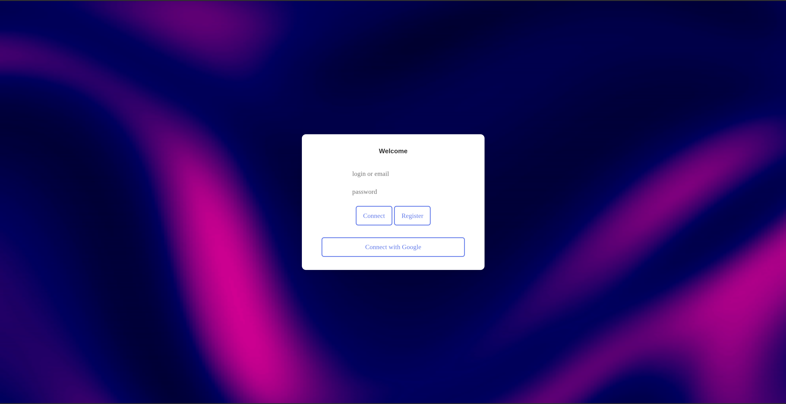
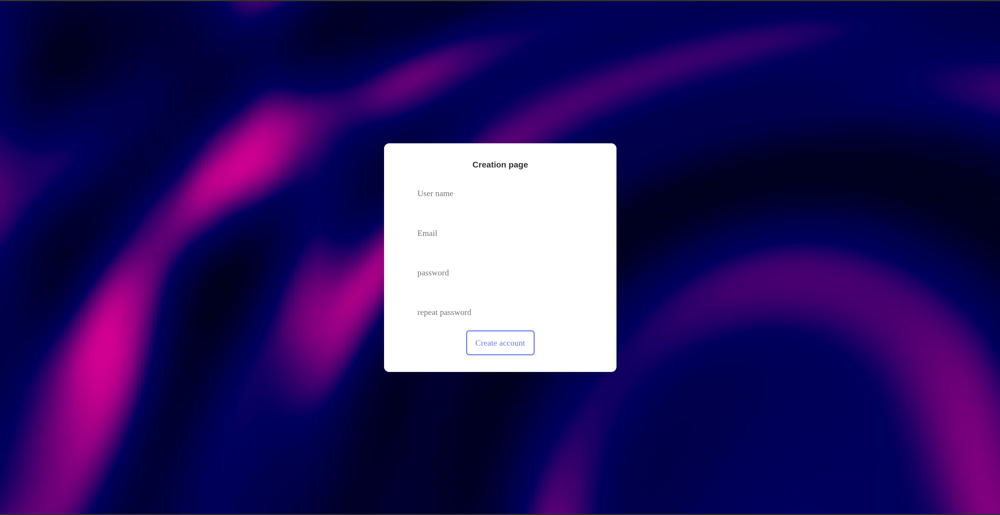
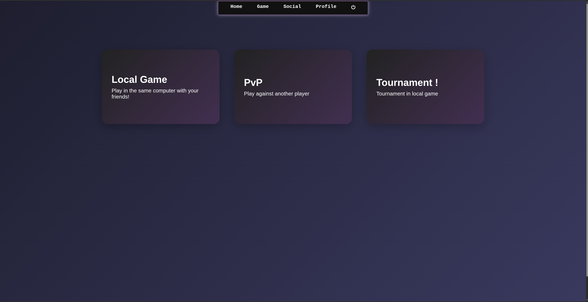
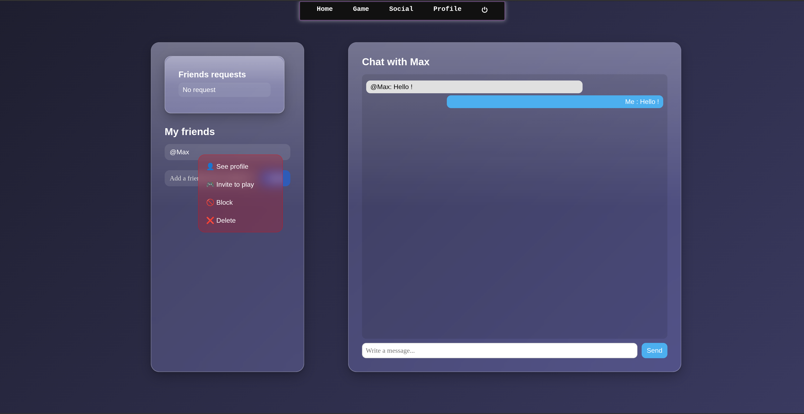
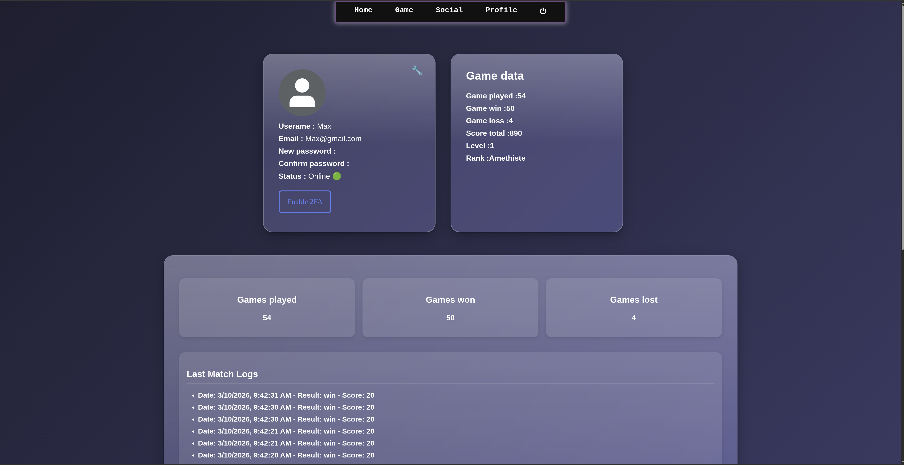
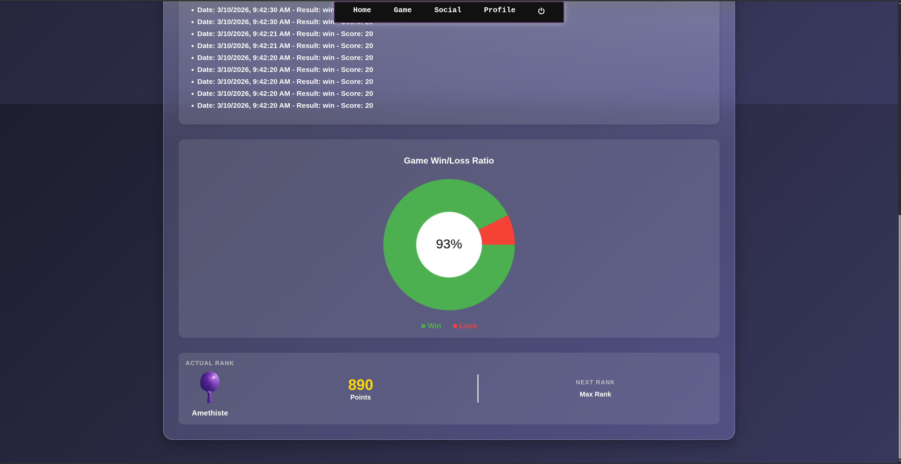

# ft_transcendence

**ft_transcendence** is a project aimed at creating a **web application** game based on the **original Pong game**.

In this project, a list of different **modules** is provided in the subject. We are free to choose the modules we want, as long as they reach a **minimum number of points**. Points are determined by whether a module is classified as major or minor. Major modules are worth 2 points, while minor modules are worth 1 point.

**All the modules** will be described in the section below.

## Modules
🔴 → Major module

🟢 → Minor module


1. User-management. 🔴
    - [x]  Users can securely subscribe to the website.
    - [x]  Registered users can securely log in.
    - [x]  Users can select a unique display name to participate in tournaments.
    - [x]  Users can update their information.
    - [x]  Users can upload an avatar, with a default option if none is provided.
    - [x]  Users can add others as friends and view their online status.
    - [x]  User profiles display stats, such as wins and losses.
    - [x]  Each user has a Match History including 1v1 games, dates, and relevant details, accessible to logged-in users.

2. Use a framework to build the backend. 🔴
    - [x]  In this major module, you are required to use a specific web framework for backend
    development: `Fastify` with `Node.js`.
    
3. Use a database for the backend -and more. 🟢
    - [x]  The designated database for all DB instances in your project is `SQLite` and may
    be a prerequisite for other modules, such as the backend Framework module.
    
4. Live Chat. 🔴
    - [x]  The user should be able to send direct messages to other users.
    - [x]  The user should be able to block other users, preventing them from seeing any
    further messages from the blocked account.
    - [x]  The user should be able to invite other users to play a Pong game through the chat interface.
    - [x]  The tournament system should be able to notify users about the next game.
    - [x]  The user should be able to access other players’ profiles through the chat
    interface.
    
5. Implement Two-Factor Authentication (2FA) and JWT. 🔴
    - [x]  Investigar sobre el Framework Legal de protección de Datos de la comisión europea para poder empezar
        
        [How does the **Legal framework of EU data protection affects us??**](https://www.notion.so/How-does-the-Legal-framework-of-EU-data-protection-affects-us-25632d0c92d8805cac42f8606abdd4ad?pvs=21)
        
    - [x]  Implement Two-Factor Authentication (2FA) as an additional layer of security
    for user accounts, requiring users to provide a secondary verification method,
    such as a one-time code, in addition to their password.
    - [x]  Utilize JSON Web Tokens (JWT) as a secure method for authentication and
    authorization, ensuring that user sessions and access to resources are managed
    securely.
    - [x]  Provide a user-friendly setup process for enabling 2FA, with options for SMS codes, authenticator apps, or email-based verification
    - [x]  Ensure that JWT tokens are issued and validated securely to prevent unauthorized access to user accounts and sensitive data.
    
6. Replace basic Pong with server-side Pong and implement an API. 🔴 
    - [x]  Develop server-side logic for the Pong game to handle gameplay, ball movement, scoring, and player interactions.
    - [x]  Create an API that exposes the necessary resources and endpoints to interact with the Pong game, allowing partial usage of the game via the Command-Line Interface (CLI) and web interface.
    - [x]  Design and implement the API endpoints to support game initialization, player controls, and game state updates.
    - [x]  Ensure that the server-side Pong game is responsive, providing an engaging and enjoyable gaming experience.
    - [x]  Integrate the server-side Pong game with the web application, allowing users to play the game directly on the website.

7. Expanding Browser Compatibility. 🟢 (need additional test after creating the game)
    - [x]  Extend browser support to include an additional web browser, ensuring that
    users can access and use the application seamlessly.
    - [x]  Conduct thorough testing and optimization to ensure that the web application
    functions correctly and displays correctly in the newly supported browser.
    - [x]  Address any compatibility issues or rendering discrepancies that may arise in
    the added web browser.
    - [x]  Ensure a consistent user experience across all supported browsers, maintaining
    usability and functionality.

8. Remote players 🔴
    - [x]  It should be possible for two players to play remotely. Each player is located on a separated computer, accessing the same website and playing the same Pong game.

## Images
<div>
    <p>
        
        
        
        
        
        
        
    </p>
</div>

## Installation
- Create or edit .env file
- Execute the command MAKE

```bash
  vim .env
  make
```
    
<div>
    <h3>Language & Tool</h3>
    <p>
        
        
        
        
        
        
    </p>
</div>
